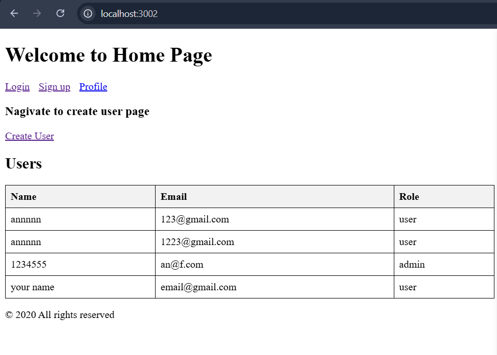
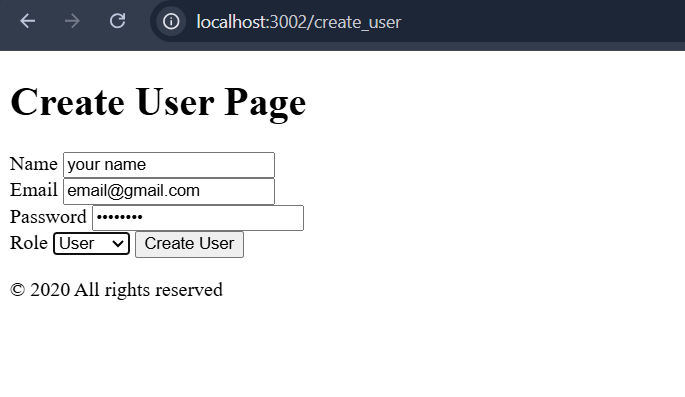
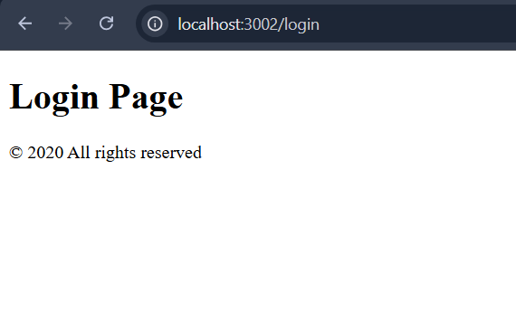

# Express.js Server with Mongoose and EJS

This project is a backend server built using **Express.js** with **Mongoose** as the ODM and **EJS** as the view engine. It connects to a MongoDB Atlas cloud database.

## Features
- RESTful API endpoints
- Integration with MongoDB Atlas for database operations
- EJS as a template engine for server-side rendering

## Requirements
- Node.js >= 16.x
- MongoDB Atlas account
- Package manager (npm or yarn)

---

## Demo

Below are some screenshots of the application:

### Home Page


### Create User


### Login Page



## Getting Started

### 1. Clone the repository
```bash
git clone <repository-url>
cd <repository-folder>
```

### 2. Install dependencies
```bash
npm install
```

### 3. Configure environment variables
1. Locate the `.env.example` file in the project root.
2. Copy `.env.example` to `.env`:
   ```bash
   cp .env.example .env
   ```
3. Open the `.env` file and fill in the following keys:
   - `PORT`: The port on which the server will run (e.g., `3000`).
   - `HOST`: The host address (e.g., `localhost`).
   - MongoDB Atlas keys:
     - `MONGODB_USERNAME`
     - `MONGODB_PASSWORD`
     - `MONGODB_URI`

   Example `.env`:
   ```env
   PORT=3000
   HOST=localhost

   MONGODB_USERNAME=<your-username>
   MONGODB_PASSWORD=<your-password>
   MONGODB_URI=<your-cluster-uri>
   ```

---

### 4. How to Get MongoDB Keys on Atlas Cloud
1. **Create a MongoDB Atlas Account**:
   - Go to [MongoDB Atlas](https://www.mongodb.com/cloud/atlas).
   - Sign up or log in.

2. **Set up a Cluster**:
   - After logging in, click **Create a Cluster**.
   - Choose a free tier and region, then click **Create Cluster**.

3. **Create a Database User**:
   - Go to the **Database Access** tab.
   - Click **Add New Database User**.
   - Enter a username and password.
   - Assign the user the **read and write** role.

4. **Get the Connection String**:
   - Navigate to **Clusters**.
   - Click **Connect** > **Connect your application**.
   - Copy the connection string (e.g., `mongodb+srv://<username>:<password>@cluster0.mongodb.net/mydatabase?retryWrites=true&w=majority`).

5. **Fill the `.env` File**:
   - Replace `<username>`, `<password>`, and `<cluster-uri>` in the connection string:
     - `MONGODB_USERNAME` = `<username>`
     - `MONGODB_PASSWORD` = `<password>`
     - `MONGODB_URI` = `your-cluster-uri`

---

### 5. Start the Server
Run the following command to start the development server:
```bash
npm start
```

The server should be running at `http://localhost:<PORT>`.

---

## Scripts
- `npm start`: Starts the server in production mode.
- `npm run dev`: Starts the server in development mode with live reloading.

---

## License
This project is licensed under the MIT License.
